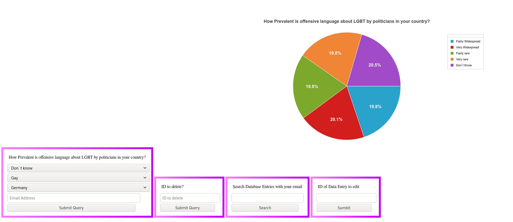

# Databases_AE2_Caitlyn_Stewart
---



---
## How to install and run:

### Dependencies:
---
#### NodeJS
#### MongoDB

#### Node JS Modules:
- Mongoose
- Express
- body-parser

### Commands:
---

``` 

git clone https://github.com/TrashKittenCait/Databases_AE2_Caitlyn_Stewart.git
npm install
mongoimport --type csv -d LGBT -c DailyLife --headerline --drop LGBT_Survery_DailyLife.csv
node main.js

```

It's important that you do not change the mongo import command as if you do you will need to change the databases and the collection names in the code. The CSV data used is stored in the Datasets directory

Dataset Used: [Kaggle LGBT Dataset](https://www.kaggle.com/ruslankl/european-union-lgbt-survey-2012)

---
### To Do List
- [x] Create data entry Functionality Added
- [x] Reading and displaying data added
- [x] Search by Email added allowing easier way to find IDs of your data entries
- [x] Update Data function added
- [x] Delete data request set up
- [x] Delete GUI added to make a easier way to delete data
